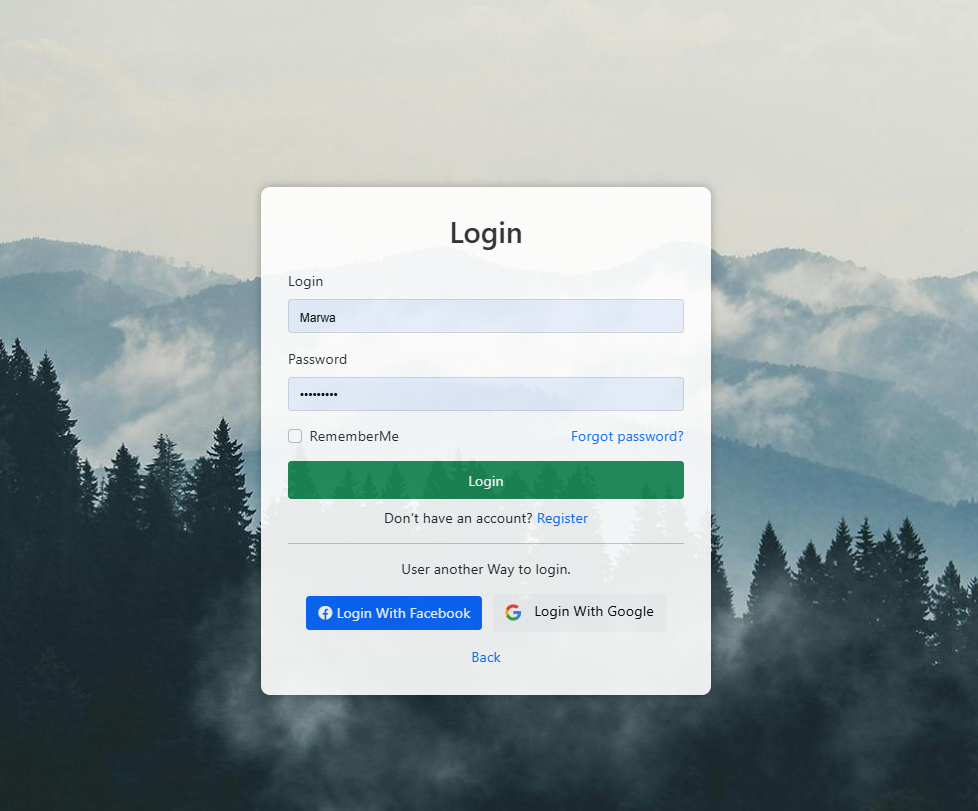

# 🔒 Custom Identity Account Management System

## 📝 Project Overview

This project is a **Custom Identity Account Management System** built using **ASP.NET Core MVC**. It provides a robust and flexible solution for user authentication, authorization, and account management. The system supports multiple login methods, including **email, username, and phone number**, as well as external logins via **Facebook and Google**. It also includes features like **password recovery, email confirmation, profile management, and role-based authorization**.

The system is designed with best practices in mind, adhering to **SOLID principles** (e.g., Single Responsibility Principle) and implemented as a **reusable service** to ensure **low coupling and high cohesion**. This makes it easy to integrate into other projects or extend with additional features.

---

## 🚀 Features

### 1️⃣ Authentication

- 🔑 **Multi-Factor Login:** Users can log in using their **email, username, or phone number**.
- 🌐 **External Logins:** Integration with **Facebook and Google** for seamless authentication.
- 📧 **Email Confirmation:** Users must confirm their email address during registration.
- 🔓 **Password Recovery:** Users can reset their password via a **secure link sent to their registered email**.

### 2️⃣ 👤 User Management

- 📝 **Profile Management:** Users can update their **personal information, including profile pictures**.
- 🔒 **Account Security:** Options to **change passwords** and manage **account settings**.

### 3️⃣ 👥 Role-Based Authorization

- 🎭 **Role Management:** Admins can **create, update, and assign roles to users**.
- 🚪 **Access Control:** Fine-grained control over **user permissions based on roles**.

### 4️⃣ 🛠️ Reusability and Extensibility


## 🛠️ Technologies Used

- **ASP.NET core MVC**: For building the web application.
- **Entity Framework**: For database operations and management.
- **Identity Framework**: For authentication and authorization.
- **OAuth 2.0**: For external login integrations (Facebook, Google).
- **SOLID Principles**: For clean and maintainable code.
- **RazorPages with HTML/CSS/JavaScript**: For the front-end interface.
  

---

## 🚀 Getting Started

### 📋 Prerequisites

- **.NET core**: Ensure you have the 8.0 version of **.NET core** installed.
- **Visual Studio**: Recommended **IDE** for development.
- **SQL Server**: For database management.

### ⚙️ Installation

#### 1️⃣ Clone the Repository:

```bash
git clone https://github.com/your-username/your-repo-name.git
```

#### 2️⃣ Open the Project:

- Open the solution file (`*.sln`) in **Visual Studio**.

#### 3️⃣ Configure the Database:

- Update the **connection string** in `appsettings.json` to point to your **SQL Server** instance.
- Run the migrations to create the database:

```bash
Update-Database
```

#### 4️⃣ Run the Application:

- Press `F5` to build and run the application.

---

## 🗂️ Code Structure

The project is organized into the following key folders:

- `Controllers/` - Handles **user requests and responses**.
- `Models/` - Contains **data models and view models**.
- `Services/` - Implements **business logic and reusable services**.
- `Views/` - Contains **Razor views for the UI**.
- `Migrations/` - Manages **database schema changes**.
- - `ViewModels/` - Contains **DTO**.


---

## 📐 SOLID Principles Applied

- ✅ **Single Responsibility Principle (SRP):** Each class and method has a **single responsibility**.
- 🔓 **Open/Closed Principle (OCP):** The system is **open for extension but closed for modification**.
- 🔄 **Liskov Substitution Principle (LSP):** Derived classes can replace base classes without affecting functionality.
- 🧩 **Interface Segregation Principle (ISP):** Interfaces are **specific to client needs**.
- 🔗 **Dependency Inversion Principle (DIP):** High-level modules depend on **abstractions, not concrete implementations**.

---

## 📸 Screenshots

Here are some screenshots of the system in action:

### 🔹 Login Page:


### 🔹 Register Page:


### 🔹 Profile Management:


### 🔹 Role Management:


### 🔹 Redirect Page:


### 🔹 Home Page:

---

## 🤝 Contributing

Contributions are welcome! If you'd like to contribute, please follow these steps:

1. **Fork** the repository.
2. **Create** a new branch for your feature or bug fix.
3. **Commit** your changes.
4. **Submit** a pull request.

---

## 📜 License

This project is licensed under the **MIT License**. See the `LICENSE` file for details.

---

## 📧 Contact

For any questions or feedback, feel free to reach out:

- 📧 \*\*Email: \*\***[marwanosamaebrahim@gmail.com](mailto\:marwanosamaebrahim@gamil.com)**
- 🐙 **GitHub:** [Otaka123](https://github.com/Otaka123)

Enjoy using the **Custom Identity Account Management System**! 🚀

